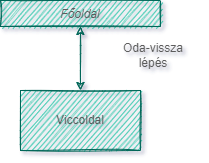

Rendszerterv

# A rendszer célja
* Vicc kategóriákra elkülönítése.
* Az oldalak között könnyű navigáció, menüsor segítségével.
* Az oldal átméretezése során, az oldal tartalma változzon úgy hogy, jól olvasható maradjon.
* Interaktív szöveg és gombok segítsék a felhasználót.
* Az oldal készítőinek elérhetőségeit feltüntetni.
* Jól olvasható szöveg, jól elkülönített tartalom.
* Jó viccek és szórakoztató tartalom.
* Feltűnő és érdekes kinézet.

# A rendszer nem célja

* Túl zsúfolt kezelő felelület.
* A viccek tartalmilag ne legyenek bántóak, támadó jellegűek.
* Összezavaró menürendszer. 
* Bejelentkezési rendszer.
* Reklám megjelenítések.
* Kötelezni a felhasználót további adatok (például : teljes név, e-mail cím) megadására.
* "Like/Dislike" alapú szavazási rendszer kialakítása a hozzászólások megbízhatóságának megszavazása érdekében.

# Projekt terv

A rendszer célja egy olyan viccportál (weboldal) létrehozása mely kifejezetten a Debreceni Egyetem Informatikai Kar tanulói és hallgatói számára készül. A hétköznapi egyetemi élet nem egyszerű és sok sokszor rengeteg stresszt jelent egy diák és oktató életében egyaránt. Ezt a stresszt próbáljuk majd csökkenteni a humor segítségével egy viccportálon keresztül. A viccek tematikájukat tekintve informatika, matematika és az egyetem lennének a főtéma.
Egy könnyen kezelhető főoldal és témaválasztó oldal az alapja, ezekről lehet tovább lépni a viccekhez melyek külön lapon szerepelnek. A viccportál felépítése könnyen átláható, oda-vissza lépés a különböző lapok között. Menüsor készítése a főoldalhoz, illetve a többi laphoz, oldalak közötti navigáció megkönnyítése és lehetővé tevése érdekében. A főoldal egy köszöntő oldal mely tovább vezet a témaválasztó oldalhoz. A témaválasztó oldal hasonlóan épül fel, viszont a tartalmi részén a témák külön megjelenítése és ismertetése van. A témaválasztó oldal segít felhasználónak és informálja őt, hogy merre tud tovább lépni. A témaválasztó oldalról olyan oldalra kerülünk melyek magukat a viccet tartalmazzák. Fontos hogy a weboldal telefonon, számítógépen is egyaránt elérhető legyen és az összes platformon megjelenítés jól nézzen ki és jól használható legyen.

# A projekten dolgozók listája és feladatai:

1. Bezerédi Erik - FullStack programozó
2. Vass Bálint - Front-end programozó
3. Ilés Zoltán - Front-end programozó
4. Kocsis Olivér - Front-end programozó

* Bezerédi Erik felelős a weboldal mögött futó programok megírása JavaScript nyelven.
* Vass Bálint felelős a weboldal stílusáért CSS fájlok megírásával.
* Illés Zoltán felelős a weboldal felépítéséért HTML fájlok megírásával.
* Kocsis Olivér felelős a weboldal stílusáért CSS fájlok megírásával.

# Ütemterv

* Követelmény specifikáció létrehozásának határideje: 2022.09.12
* Funkcionális specifikáció létrehozásának határideje: 2022.09.12
* Rendszterv létrehozásának határideje: 2022.09.19
* Projekt tesztelésének határideje:2022.09.26
* A weboldal elkészülésének határideje: 2022.09.26

# Elképzelés a weboldal kinézetéről:
* Elképzelt kezdőoldal: 

* Elképzelt kategóriák: 

* Elképzelt Elérhetőség: 

* Elképzelt viccoldali elérhetőség: 

* Elképzelt viccek: 

# Megvalósított weboldal kinézet:
* Megvalósított kezdőoldal: 

* Megvalósított kategóriák: 

* Megvalósított Elérhetőség: 

# Mérföldkövek

  1. Funkcionális specifikáció és követelmény specifikáció létrehozása
  2. Rendszerterv megalkotása
  3. A főoldal létrehozása
  4. Főoldal megformázása, és stílus megalkotása
  5. Elérhetőség hozzáadása a főoldalhoz
  6. Vicceket tartalmazó oldal létrhozása
  7. Viccek összeírása, és feltétele az oldalra
  8. Vicceket tartalmazó oldal stílusának létrehozása
  9. Menüsor kialakítása
  10. Oldalak összekapcsolása, menüsor használatával
  11. Interaktív gombok, szövegek hozzáadása
  12. Tesztelés
  13. Bemutatás

### Üzleti szereplők
+ A weboldal használói főleg az egytem hallgatói lesznek, de hozzáférése mindenkinek lesz aki rendelkezik internet hozzáféréssel. 
+ Tehát az egyetemen kivüli személyek is használhatják fontos, hogy könnyen értelmezhető és kezelhető legyen.

### Üzleti folyamatok
+ A folyamat, a használat nagyon egyszerű.
+ A kezdőoldal tetején találhatóak a gombok amelyekkel lehet kiválasztani a vicc kategóriákat, illetve egy vissza gomba az oldalakon.
+ 9 vicc kategória közűl lehet majd választani pl : Ik -s viccek, matekos ...
+ A ketgória kiválasztása után betölti a vicceket és az oldalon lehet olvasni ezeket, továbbá megjelenik egy vissza gomb ami vissza vissz a főoldalra.
+ A visszagombra kattintva az eddig betoltött viccek értelem szerűen eltünnek és a főoldal jelenik meg.

## Absztrakt domain modell
---

Itt írjuk le a megvalósítandó rendszer fogalmait, illetve a
megvalósítás nagyon magas szintű vázát általában egy-két konkrét példán keresztül.

 Fogalmak melyekkel tisztában kell lennünk:
---

* **Modell:** Az alkalmazás által kezelt információk tartomány-specifikus ábrázolása.

* **Nézet:** Megjeleníti a modellt egy megfelelő alakban, mely alkalmas a felhasználói interakcióra, jellemzően egy felhasználói felületi elem képében.

* **Vezérlő:** Az eseményeket, jellemzően felhasználói műveleteket dolgozza fel és válaszol rájuk.
A 3 komponens közül a modell lesz egyenlő az adatbázissal, a nézet a frontend-el és a vezérlő a backend-el.

Így felmerül 3 új szintén fontos fogalom:
---

* **Adatbázis:** Tárolt adatok összessége.

* **Frontend:** A webalkalmazás azon része, melyet maga a felhasználó lát és interakcióba tud lépni vele.

* **Backend:** A webalkalmazás azon része, mely az adatok feldolgozásáért felel.

[ A rendszerünk egy gépből áll, mivel a weboldal csak az adott gépen fut, használ hálózati kapcsolatot, kommunikál lokál szerverrel (xampp). ]

## Architektúrális terv

A weblap egy szerveren fut, amit bárki bármikor elérhet.
 
A felhasználó az oldalt nem tudja módosítani azaz viccet hozzáadni, viszont a dokumentumok nincsenek titkosítva.

## Adatbázis terv

Az adattárolás egy adatbázis segítségével valósul meg. Ahhol a ketegóriák szerint tároljuk a vicceket.

pl: |Programozos| Matek | ...

és ezen oszlopok tartalmazzák majd a témának megfelelő vicceket. 
Minden kategóriához 10 - 20 vicc tartzik.

## Követelmények

+ Könnyen kezelhető felület.
+ Telefonról és gépről egyaránt jól kinéző.
+ Figyelemfelkeltő kinézet és effektusok használata.
+ Interaktív legyen.
+ Elérhetőség, hogy a felhasználók tudjanak ötletet megosztani a szerkesztőkkel.
+ Jól elkülönithetőek legyenek a vicc kategóriák.
+ Lehessen bővíteni a kategóriákat a program átadása után.

## Tesztterv
------------------------------
Minden programot tesztelni kell, mivel sohasem lehet tudni mikor mi nem működik úgy ahogy annak kellene.
Tökéletes kód nem létezik, ezért van szükség tesztelésre.
A kód írója persze állandóan nézi, hogy amit implementál, az úgy működik-e, ahogy ő azt tervezte, azonban ez szinte soha sem elég.
Ezért van mindig szükség legalább egy, de inkább több harmadik személyre is, akik kipróbálják a programot, mert ahány ember, annyiféle módon használnak egy alkalmazást.
Így bukkanhatunk rá olyan hibákra is, amire egyáltalán nem is számítottunk.
Azonban nem csak hibákat próbálunk keresni teszteléskor, hanem más szempontjából is akarjuk látni, hogy milyen is maga a program.
Kaphatunk ötleteket, hogy mivel egészítenék ki az eddigi munkát, vagy hogy min változtatnának rajta, mivel szerintük az jobb lenne a felhasználóknak.

A tesztelés fázisai:
* manuális teszt
* automatizált teszt
* alpha teszt
* beta teszt

A manuális teszt olyan teszt amit személyesen végzünk.

Az alpha teszt legfőképp in-house történik, hogy megnézzük működnek-e az alapfunkciók. Ilyen lehet például:

- elindul-e a program más környezetben/számítógépen
- működik-e minden gomb
- egy gomb nyomására az elvárt eredményt kapjuk-e, jelen esetben angol nyelv választásakor angol szavak jelennek-e meg

A beta teszt pedig már lehet nyilvános is, ilyenkor akárki tesztelheti, aki szeretné. Ekkor már rengeteg visszajelzést kaphatunk, lehet az bug report, vagy új ötlet, változtatás az eddigi működésben. Például:

- gombok elhelyezése
- Reportok fogadása
- más háttér alkalmazása

Sikeresnek mondható a teszt, ha már szinte semmiféle probléma nem található a programban, és a mások által feltett és a fejlesztő által elfogadott változtatásokat, újításokat is implementáltuk. Ezután meg is történhet a szoftver első kiadása.

## Funkcionális terv
A funkcionális működést az alábbi képernyő tervekkel szeretném felvázolni. Amint megnyitjuk a weblapot és az betölt egyből a fő oldaltárul elénk amin fel van tüntetve a weboldal neve,
valamint egyértlemű választás elé állít minket hogy válasszuk ki a viccek menüpontot. Ezután az oldal a megfelelő helyre navigál minket. Amint kiválasztjuk az egyik témát,a fenti fejléc nem változik csak a weboldal. Az oldal jobb oldalán lévő vagy az egér görgő gombja segítségével lejjeb lehet tekerni.
Ez által a teljes oldalt megtekinteni. Amint meguntuk ezt a témát a vissza gomb segítségével visszaléphetünk a főoldalra. Ezután a fejléc továbbra sem változik csak az oldal. Megtalálható egy rólunk menüpont is amely a fejlesztőket tartalmazza. Amennyiben van saját ötletünk ezt megoszthatjuk a fejlesztőkkel. Ezt ugyanúgy a elérhetőség menüpont alatt lehet megtalálni. Itt emailen keresztül szöveges lehetőségünk van leírni az ötletünket illetve jelenteni a talált hibákat. 

### Szerepkörök:Felhasználó

### Rendszerszereplők
Felhasználó

### Rendszerhasználati esetek és lefutásaik:
#### Felhasználó:

+ képes vicceket olvasni
+ oldalak közötti tetszőleges lépegetés
+ ötlet megosztás
+ hibákat jelenteni

### Menü hierarchiák:
#### Rólunk:
+ ötletmegosztás
+ hiba bejelentés

#### Témák: 

+ Számítástechnika
+ Sport
+ Autós 
+ Szőkenős 
+ Móriczka
+ Iskola
+ Fárasztó 
+ Hallott csecsemős
+ Rasszista
+ Informatikus
+ Matek

## Fizikai környezet

Visual studio code-ot használtunk.

### File tipusok
+ Css
+ java scripts
+ html

### Kölső szoftverek

+ Visual studo code
+ Vercel

## Karbantartási terv
A weblap folyamatos üzemeltetése és karbantartása, mely
magában foglalja az esetleges hibák elhárítását, a belső igények változása miatti
módosításokat, valamint a környezeti feltételek változása miatt
megfogalmazott weblap, illetve állomány módosítási igényeket. 
Idő elteltével új témákat kell hozzáadni a weblaphoz, hogy fent tartsuk az
érdeklődési szintet.
### Karbantartás
Corrective Maintenance: A felhasználók által felfedezett és "user reportban"
elküldött hibák kijavítása.
Adaptive Maintenance: A program naprakészen tartása és finomhangolása.
Perfective Maintenance: A szoftver hosszútávú használata érdekében végzett
módosítások, új funkciók, a weboldal teljesítményének és működési
megbízhatóságának javítása.
Preventive Maintenance: Olyan problémák elhárítása, amelyek még nem
tűnnek fontosnak, de később komoly problémákat okozhatnak.

## Fogalomszótár
------------------------------

* **Frontend:**
Frontend-nek számít minden, amit egy weboldalon látsz: funkciók, dizájnelemek, felépítés.

* **Backend:**
A Backend a háttérben futó folyamatokkal foglalkozik, pl. szerveroldali programozással, űrlapon beküldött adatok feldolgozásával, statisztika készítéssel.

* **HTML:**
A HTML (angolul: HyperText Markup Language, „hiperszöveges jelölőnyelv”) egy leíró nyelv, melyet weboldalak készítéséhez fejlesztettek ki.

* **CSS:**
A CSS (Cascading Style Sheets, magyarul: „lépcsőzetes stíluslapok”) a számítástechnikában egy stílusleíró nyelv, mely a HTML vagy XHTML típusú strukturált dokumentumok megjelenését írja le.

* **JavaScript:**
A JavaScript programozási nyelv egy objektumorientált, prototípus-alapú szkriptnyelv, amelyet weboldalakon elterjedten használnak.

* **PHP:**
Egy általános szerveroldali szkriptnyelv dinamikus weblapok készítésére. Az első szkriptnyelvek egyike, amely külső fájl használata helyett HTML oldalba ágyazható. A kódot a webszerver PHP feldolgozómodulja értelmezi, ezzel dinamikus weboldalakat hozva létre.

* **MySQL:**
A MySQL egy többfelhasználós, többszálú, SQL-alapú relációs adatbázis-kezelő szerver. (Viccek tárolását segíti)

* **XAMPP:**
Egy szabad és nyílt forrású platformfüggetlen webszerver-szoftvercsomag, amelynek legfőbb alkotóelemei az Apache webszerver, a MariaDB adatbázis-kezelő, valamint a PHP és a Perl programozási nyelvek értelmezői.

* **Vercel:**
A vercel egy ingyenes statikus weblapmegosztó szolgáltatás.