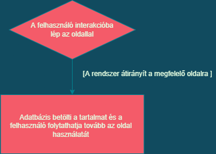

# A rendszer céljai:
1. A diákoknak több kedvük legyen a tanuláshoz. Például olyan viccekkel melyek iskolához kapcsolódnak.
2. Telefonról is el lehet érni, kinézete megfelelő, nem csúszik ki a képernyőről.
3. Feltűnő és érdekes kinézet.
4. Tanulás vicces formája (például matematikával kapcsolatos viccek).
5. Egyszerűség, nem túl bonyolított kezelő felület.
6. Egy felülről menüvel ellátott főoldal, illetve onnan elérhető oldalak.
7. Görgetési lehetőség.
8. A böngésző ablak méretezése során az oldal jól reagáljon és az új paraméterekhez hűen változzon.
9. A különböző oldalak közötti egyszerű és gyors váltás, az oldal tetején megtalálható menüsor segítségével.
10. Az oldalon megjelenő tartalom (viccek) jó tagoltsága, az oldal közepén elhelyezése, jól olvashatóak legyenek.

# A rendszer nem céljai:
1. Túl zsúfolt kezelő felelület.
2. A viccek tartalmilag ne legyenek bántaóak, támadó jellegűek.
3. Összezavaró menürendszer.

# Miért esett erre a döntés, jelenlegi helyzet:

A diák élethez hozzá tartozik a folyamatos megfeszített tanulás és figyelés, viszont minden embernek szüksége van a kikapcsolódásra, és a humorra. A DE hallgatói sem különböznek ettől. Jelenlegi helyzet odáig fajult, hogy a diákok kezdek elveszteni a tanuláshoz való vágyukat. Egy olyan megoldásra van szükségünk amely gyorsan, mindenki számára elérhető.

## Megrendelői vízió (Vágyálom)
Az informatikával, matematikával kapcsolatos viccek segítségével csökkentsük a feszültséget. Egy könnyen elérhető vicc portál. A célja az lenne, hogy humor segítségével feltöltse az olvasót.
Egy könnyen átlátható, használható rendszer felépítés. A weboldal színes és feltűnő legyen. A gombok jól láthatóak legyenek, legyen eltérő színűk, mintázatuk az oldal főkoncepciójához képest, de maradjanak összhangban. Az oldal használata közben ha megváltozik a képarány jól alkalmazkodjon hozzá a weboldal, úgy is jól használható maradjon. Törekedni kell az egyszerű de ötletes megoldásokhoz. A weboldal több lapja között való lépegetés könnyen elérhető legyen. A viccportál lapjai között a kinézet valamilyen szinten módosuljon, kisebb változtatások a gombok színe, háttérelemek, betűtípus változzon meg. Interaktív gombok és szövegek használata, melyekhez különböző funkciókat kötünk hozzá, mint például szövegre kattintva tovább irányít egy másik linkre a weboldal.
#
## Használati esetek
A használati eset a rendszer és a felhasználók közötti kommunikációt írják le.

**Egy példa** : A felhasználó rákattint a témákra és ott megkeresi a számara meg felelő vicc kategóriát és ekkor átirányítja az oldal a megfelelő viccekhez és az adatbázis betőlti mindeközben a kivánt tartalmat.

* Az oldal használata alatt az értendő, hogy a felhasználó olvassa a vicceket, vissza lépés gomb használata is ide tartozik.

#

## Megrendelői követelmény:
1. Könnyen kezelhető felület.
2. Telefonról és gépről egyaránt jól kinéző.
3. Figyelemfelkeltő kinézet és effektusok használata.
4. Interaktív legyen.
5. Elérhetőség, hogy a felhasználók tudjanak ötletet megosztani a szerkesztőkkel.
6. Jól elkülönithetőek legyenek a vicc kategóriák.
7. Minden oldalon legyen lehetőség vissza lépni a főoldalra, ezzel is szertnénk hangsújozni az **1. pontban foglaltakat**.

## Képernyő tervek
#
**A képernyő tervek mutatják meg, hogy mely funkciók kerülnek egymás mellé, melyik képernyőről
mely képernyőre juthatunk.** 
1. A főoldalon minden funkció elérhető legyen. 
Itt vannak feltüntetve a témák amelyeket ki lehet választani 
fontos, hogy mindegyik a megfelelő oldalt töltse be.

2. Fontos hogy átlátható, szellős legyen, különüljenek el egymástól az egyes funkciók. Jól látható és mindenki számára egyértelmű értelmezhető gombok és hivatkozások. 
**Példa:** Visszaléps gomb 

3. Konzisztens legyen, tehát minden oldalon lehetőség szerint hasonló műveleteket hasonló módon kell reagálniuk. Ismételten a vissz gomb példája, csak is vissza léphet nem előre. Megjelenítése meg kell, hogy egyezzen az előző oldalakéval és ez minden eggyes funkcióra ez vonatkozik mind megjelenítés és reakció szempontjából.

**A mintán a főoldal és a témák egyszinten vannak mivel az a főoldalon belűl fog majd elhelyezkedni és innnen történik majd az átírányítás.* 
#

