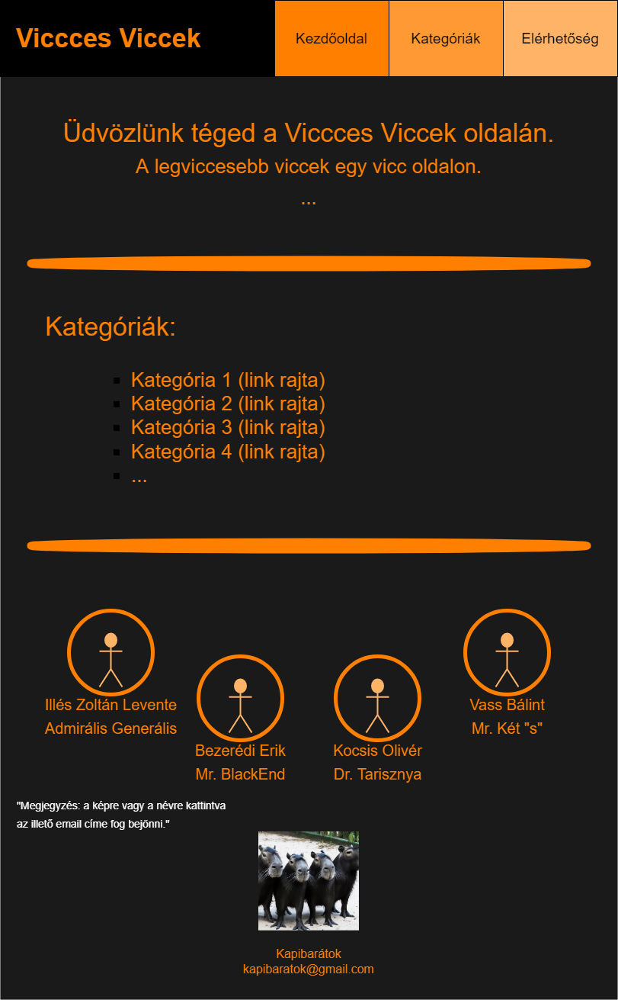
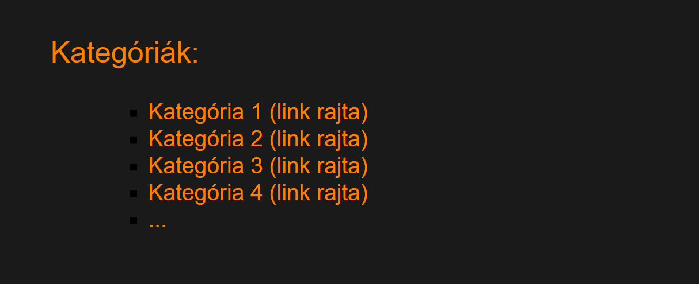
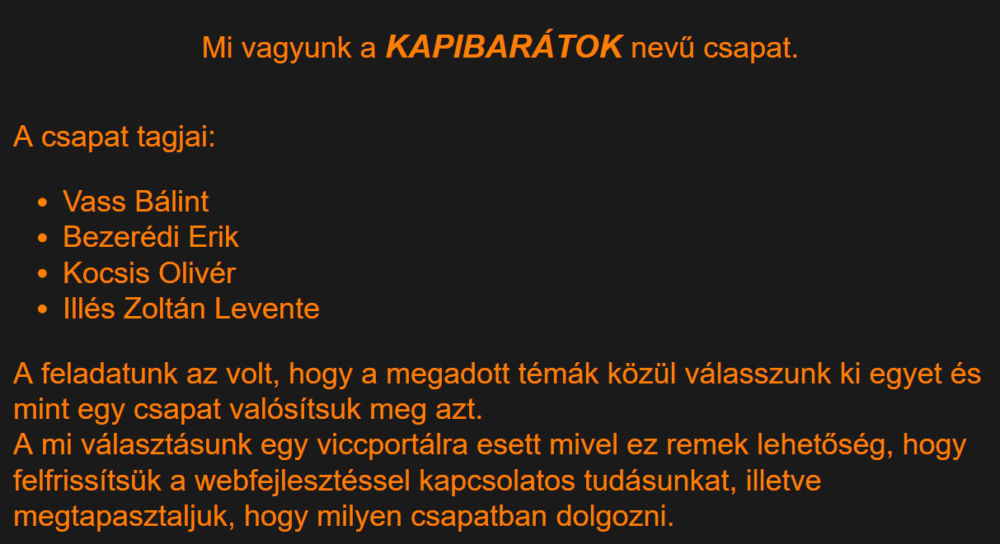
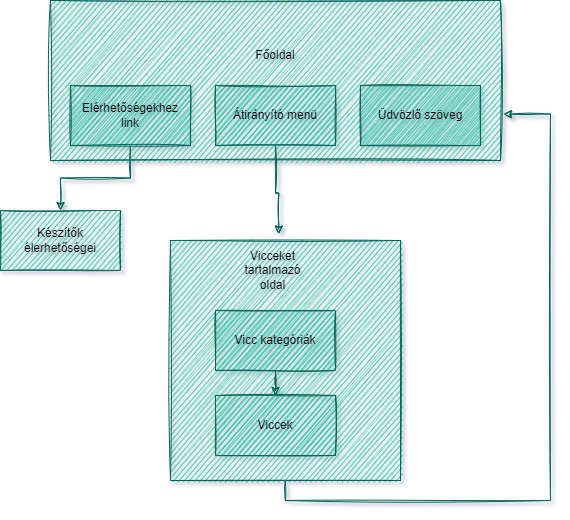
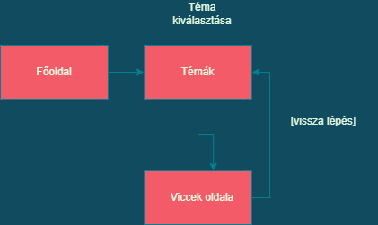

# Áttekintés:

A diák élethez hozzá tartozik a folyamatos megfeszített tanulás és figyelés, viszont minden embernek szüksége van a kikapcsolódásra, és a humorra. A DE hallgatói sem különböznek ettől. Jelenlegi helyzet odáig fajult, hogy a diákok kezdek elveszteni a tanuláshoz való vágyukat. Egy olyan megoldásra van szükségünk amely gyorsan, mindenki számára elérhető. Egy vicc portál létrehozása javíthatna a tanulók morálján. Mivel az Egyetem a teljes területén lehetőséget biztosít az internethez való csatlakozáshoz (eduroam) ezért egy webes felület megfelelne erre a célra. Úgy gondoljuk ezek a lépések nagyban elősegítik a halgatók produktív munkáját. Ezek a reál tárgyak nagyon unalmasak lehet időnként ezért hasonló témájú viccekkel próbáljuk a tanulókat rávenni arra hogy tanuljanak vagy csak kedvet kapjanak a tanuláshoz,illetve csak kikapcsolódni a fáradságos nap végén. A másik hatalmas előnye hogy teljesen ingyenes így bárki bárhonann bármikor elérheti.

# Jelenlegi helyzet:

A megrendelő szeretné hogy a diákok még motiváltabban tanuljanak, hogy versenytársaihoz képest így jusson piaci illetve némi  személyes előnyre is azáltal hogy az általa tanított tárgyakat a diákok jobban megszeressék. Egy új weblap előállítását rendelte meg,amely növeli a diákok morálját modern módszerekkel. Ez a felület az interneten lesz elérhető mivel a XXI. század megköveteli hogy ezt bárhol bármikor elérhessék ezért diákok. Ez a weblap segítséget fog nyújtani azok számára akiknek nincs elég motivációjuk a tanuláshoz. A diákoknak nagyon tetszett az effajta játékos és különleges lehetőség ezt a tanárok is felisemerték ezért minnél több platformon szeretnék ezt lehetővé tenni.Találtak többet is (pl.:Kahoot), viszont ezek nem tetszettek nekik mivel ez competitiv illetve önállóan nem lehet hatékonyan használni. Ezen okokból kifolyólag
megkértek minket, hogy csináljuk meg nekik ezt a vágyott weboldalt,ami sokkal könnyebbé teheti számukra az oktatást.

## Jelenlegi elképzelés:
* Elképzelt kezdőoldal: 

* Elképzelt viccek: 

* Elképzelt Elérhetőség: 

* Visszagomb 

# A rendszer céljai:
* A diákoknak több kedvük legyen a tanuláshoz. Például olyan viccekkel melyek iskolához kapcsolódnak.
* Telefonról is el lehet érni, kinézete megfelelő, nem csúszik ki a képernyőről.
* Feltűnő és érdekes kinézet.
* Tanulás vicces formája (például matematikával kapcsolatos viccek).
* Egyszerűség, nem túl bonyolított kezelő felület.
* Egy felülről menüvel ellátott főoldal, illetve onnan elérhető oldalak.
* A böngésző ablak méretezése során az oldal jól reagáljon és az új paraméterekhez hűen változzon.
* A különböző oldalak közötti egyszerű és gyors váltás, az oldal tetején megtalálható menü és visszagomb segítségével.
* Az oldalon megjelenő tartalom (viccek) jó tagoltsága, az oldal közepén elhelyezése, jól olvashatóak legyenek.

# A rendszer nem céljai:
* Túl zsúfolt kezelő felelület.
* A viccek tartalmilag ne legyenek bántóak, támadó jellegűek.
* Összezavaró menürendszer. 
* Bejelentkezési rendszer.
* Reklám megjelenítések.
* Kötelezni a felhasználót további adatok (például : teljes név, e-mail cím) megadására.
* "Like/Dislike" alapú szavazási rendszer kialakítása a hozzászólások megbízhatóságának megszavazása érdekében.

## Megrendelői vízió (Vágyálom)
A mindennapi élet és az informatikához köthető viccek segítségével csökkentsük a feszültséget. Egy könnyen elérhető vicc portál. A célja az lenne, hogy humor segítségével feltöltse az olvasót.
Egy könnyen átlátható, használható rendszer felépítés. A weboldal stílusos és feltűnő legyen. A gombok jól láthatóak legyenek, legyen jól kítűnő színű, mintázatuk és az oldal főkoncepciójához képest maradjanak összhangban. Az oldal használata közben ha megváltozik a képarány jól alkalmazkodjon hozzá a weboldal, úgy is jól használható maradjon. Törekedni kell az egyszerű de ötletes megoldásokhoz. A weboldal több lapja között való lépegetés könnyen elérhető legyen. A viccportál lapjai között a kinézet valamilyen szinten módosuljon, kisebb változtatások a gombok színe, háttérelemek, betűtípus változzon meg. Interaktív gombok és szövegek használata, melyekhez különböző funkciókat kötünk hozzá, mint például szövegre kattintva tovább irányít egy másik linkre a weboldal.

#
## Használati esetek
A használati eset a rendszer és a felhasználók közötti kommunikációt írják le.

**példák** : A felhasználó rákattint a viccekre és az oldal a megfelelő helyre ugrik.

 <table>
                <tr>
                    <td class="tematabla"><a href="#C1">Számítástechnika</a></td>
                </tr>
                <tr>
                    <td class="tematabla"><a href="#C2">Sport</a></td>
                </tr>
                <tr>
                    <td class="tematabla"><a href="#C3">Autós viccek</a></td>
                </tr>
                
</table>

A felhasználó innen rákattint egy megfelelő vicc témára és az oldal a megfelelő helyre navigálja. Innen egyértelmű módon olvashat vicceket. Majd innen vagy az oldal tetejére lapoz vagy a vissza gomb segítségével újra megismétli a folyamatot. 

## Megrendelői követelmény:
1. Könnyen kezelhető felület.
2. Telefonról és gépről egyaránt jól kinéző.
3. Figyelemfelkeltő kinézet és effektusok használata.
4. Interaktív legyen.
5. Elérhetőség, hogy a felhasználók tudjanak ötletet megosztani a szerkesztőkkel.
6. Jól elkülönithetőek legyenek a vicc kategóriák.
7. Minden oldalon legyen lehetőség vissza lépni a főoldalra, ezzel is szertnénk hangsújozni az **1. pontban foglaltakat**.

# Jelenlegi üzleti folyamatok modellje
Sajnálatos módon a mai világban az oktatás nem használja ki megfelelő módon a technológiákat
arra, hogy a tanulást sokkal szórakoztatóbbá és interaktívabbá tegye ezáltal a diákok sokkal motiválatlanabbak és egyre kevesebb kedvük van tanulni. Ez egyértelműen látszik a mostani diákokon akik már kiskoruk óta használnak valami okos eszközt. Legfőképpen tankönyevből tanulnak mellyek nem interaktívak és legtöbbször csak száraz tényeket tartalmaznak, nem beszélve arról hogy mennyire pazarékolja a papírt illetve ennek az extra költségéről.

# Igényelt üzleti folyamatok modellje
Azért hogy megkönnyítsük a diákok és a tanárok feladatát, létrehozunk egy weblapot ami a mai kornak megfelelően
helyt tud állni az elektronikai világban. A rengeteg stressz,szorongás közben könnyedén feloldódhatnak illetve megismerhetik a az adott témához  kapcsolódó vicceket melyekkel érdekesebbé válik az adot téma. Illetve a mindennapi élethez kötödő vicceket is lehet találni a weboldalon.

## Képernyő tervek
#
**A képernyő tervek mutatják meg, hogy mely funkciók kerülnek egymás mellé, melyik képernyőről
mely képernyőre juthatunk.** 
1. A főoldalon minden funkció elérhető legyen. 
Itt vannak feltüntetve a vicc témák  amelyeket ki lehet választani, innen a viccek oldalra navigál a rendszer.
Fontos, hogy mindegyik a megfelelő oldalt töltse be.

2. Fontos hogy átlátható, szellős legyen, különüljenek el egymástól az egyes funkciók. Jól látható és mindenki számára egyértelmű értelmezhető gombok és hivatkozások. 
**Példa:** Visszalépa gomb 

3. Konzisztens legyen, tehát minden oldalon lehetőség szerint hasonló műveleteket hasonló módon kell reagálniuk. Ismételten a vissz gomb példája, csak is vissza léphet nem előre. Megjelenítése meg kell, hogy egyezzen az előző oldalakéval és ez minden eggyes funkcióra ez vonatkozik mind megjelenítés és reakció szempontjából.

**A mintán a főoldal és a vicc témák egyszinten vannak mivel az a főoldalon belűl fog majd elhelyezkedni és innnen történik majd az átírányítás.* 
#

## Forgatókönyvek
------------------------------
* A felhasználó megnyitja a weboldalt és az betölti a kezdőképernyőt. Ezután választhat a megadott kategóriák közül, hogy milyen vicceket szeretne látni. Több kategória közül kiválasztja a matematikával kapcsolatos vicceket, és itt böngészheti ezeket. A felhasználó az oldal vagy a böngésző becsukásával léphet ki a weblapról.
* Ha felhasználónak eszébe jut egy vicc, mely kapcsolódik a témához, ezért megnyitja az "Elérhetőség" oldalt. Itt üzenetet küld a szerkesztők számára a megadott emailcím alapján. Ezt a szerkesztők elolvassák. Ha megfelel minden kritériumnak akkor publikálásra kerül.

# Olvasmányos dokumentum:

    Ez egy legendás történet Ezékiel-ről szól a hirhedt informatikusról. Hirhedt 50kg-ja, zsírpacás kockás ingjét és 
    szandál papucsát mindenki ismerte és félte. Kivillanó fogszabályzója és négyzetes szemüvege minden nőt rögtön elcsábított. Eggyik nap egy tanár lépett hozzá, az IK kedvence Mr. Jegemszkij Petrik. Rengeteg beceneve volt: majd jövőre, maximum kettes. Mindenki szerette. Osztályzását és számon kérését mindenki ismerte. A diákok főként azért szerették, mert ő nem kínozta a diákokat öt jegy lehetőséggel... csak kettővel.
    Nem is kellet neki több, kapott a lehetőségen és főhősünknek adott egy lehetőséget. Ilyen lehetőséget nem illik visszautasítani
    és kapott is egy 700 oldalas dokumentumot hogy tanulja meg. Ezékielnek hamar elment a kedve érezte hogy itt a vég. De akkor megtalált egy vicc portált. Amint megnyitotta a design szinte már erőtt adott neki, de sajnos a feladat túl nagy nagy falat volt így is.
    Amint rávitte a viccek menüre a hatalmas gigászi bizánci méretű kis egeret, meglepődve látta, hogy mennyi téma van nem is beszélve a legördülő menüsorról.
    Nem is habozott. Kiválasztotta a matematikai vicceket, de olyan jók voltak, hogy a rábízott feladat már nem is "számított" annyira fellelkesült. Az a 700 oldal rögtön elrepült. Olyan dolog történt, ami még soha, négyest kapott. Amikor a többi hiéna ezt megtudta és legnyagobb szükségük volt rá, ő eltűnt. Azóta se került elő, de a tudást hátra hagyta.
    Annyira hálás volt, hogy tudni akarta kik ezek a maszkos hősök. Megtalálta a szerény hősöket elérhetőség menüpont alatt.
    Fel is vette velük a kapcsolatot, hogy valamiféleképpen meghálálja. Végül saját ötletekkel is támogatta ezt a tökéletes weboldalt.
    Vajon ő is hőssé vált? Sose derül ki mostmár!

## Fogalomszótár
------------------------------

* **Frontend:**
Frontend-nek számít minden, amit egy weboldalon látsz: funkciók, dizájnelemek, felépítés.

* **Backend:**
A Backend a háttérben futó folyamatokkal foglalkozik, pl. szerveroldali programozással, űrlapon beküldött adatok feldolgozásával, statisztika készítéssel.

* **HTML:**
A HTML (angolul: HyperText Markup Language, „hiperszöveges jelölőnyelv”) egy leíró nyelv, melyet weboldalak készítéséhez fejlesztettek ki.

* **CSS:**
A CSS (Cascading Style Sheets, magyarul: „lépcsőzetes stíluslapok”) a számítástechnikában egy stílusleíró nyelv, mely a HTML vagy XHTML típusú strukturált dokumentumok megjelenését írja le.

* **JavaScript:**
A JavaScript programozási nyelv egy objektumorientált, prototípus-alapú szkriptnyelv, amelyet weboldalakon elterjedten használnak.

* **PHP:**
Egy általános szerveroldali szkriptnyelv dinamikus weblapok készítésére. Az első szkriptnyelvek egyike, amely külső fájl használata helyett HTML oldalba ágyazható. A kódot a webszerver PHP feldolgozómodulja értelmezi, ezzel dinamikus weboldalakat hozva létre.

* **MySQL:**
A MySQL egy többfelhasználós, többszálú, SQL-alapú relációs adatbázis-kezelő szerver. (Viccek tárolását segíti)

* **XAMPP:**
Egy szabad és nyílt forrású platformfüggetlen webszerver-szoftvercsomag, amelynek legfőbb alkotóelemei az Apache webszerver, a MariaDB adatbázis-kezelő, valamint a PHP és a Perl programozási nyelvek értelmezői.
