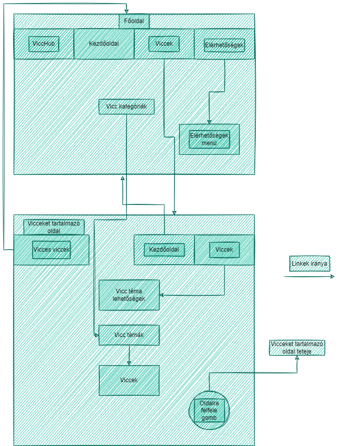
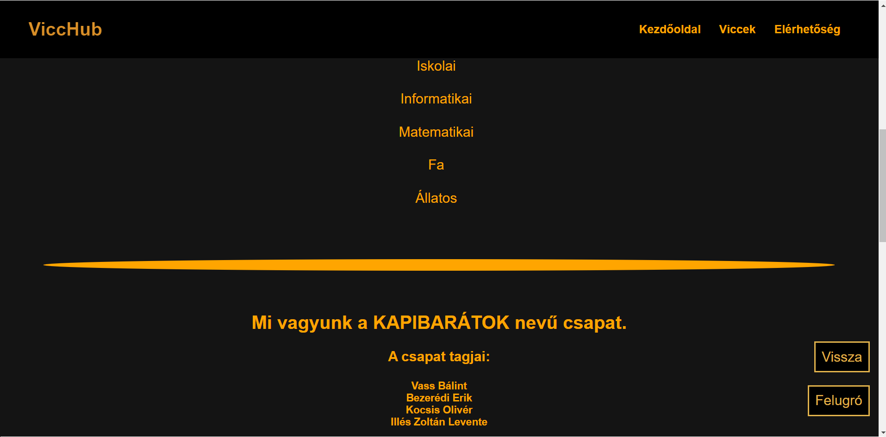
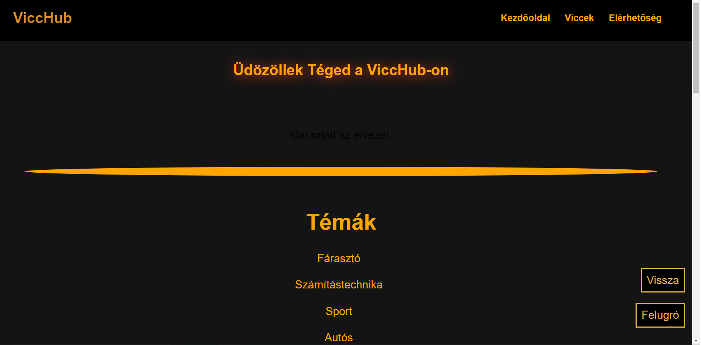

# ***Tesztelések dokumentációi***

## Elérhetőség tesztelése

### 1. Neveken lévő hivatkozás tesztelése:
### 1.1 **Elvárás:**
* Névre kattintva be kell jönnie egy email küldő felületnek, ahol az általunk kiválaszott személy számára küldhetünk email-t.
### 1.2 **Teszt:**
* **Illés Zoltán Levente** hivatkozás: a névre kattintva bejön az emailküldő felület, ahol Illés Zoltán Levente számára küldhetünk email-t.
* **Bezerédi Erik** hivatkozás: a névre kattintva bejön az emailküldő felület, ahol Bezerédi Erik számára küldhetünk email-t.
* **Kocsis Olivér** hivatkozás: a névre kattintva bejön az emailküldő felület, ahol Kocsis Olivér számára küldhetünk email-t.
* **Vass Bálint** hivatkozás: a névre kattintva bejön az emailküldő felület, ahol Vass Bálint számára küldhetünk email-t.
* **Kapibarátok** gmail hivatkozás: a névre kattintva bejön az emailküldő felület, ahol a fejlesztő csapat számára küldhetünk email-t.

### 2. Tábla kicsúszás:
### 2.1 **Elvárás:**
* A csapat tagjai tábla ne csússzon ki a képből.
### 2.2 **Teszt:**
* Megadott képernyőméret esetén a csapat tagjai táblázat "húzhatóvá" válik.

---

## **Hivatkozások tesztelése**

### **Elvárás:**
* A főoldal menüsorában a "Viccek" szóra kattintva átirányítja a felhasználót egy másik oldalra melyen a viccek találhatók. A vicceket tartalmazó weboldalról a menüsor használatával a "Vicces viccek" illetve a "Kezdőoldal" szavakra kattintva visszakerül a felhasználó a főoldalra. A vicceket tartalmazó weboldalon a menüsorban a "Viccek" szóra kattintva az oldal lentebb ugrik a "Vicc téma lehetőségek" felirathoz. A vicceket tartalmazó weboldal "Vicc téma lehetőségek" felirat alatt a vicc kategóriák megnevezéseire kattintva az oldal elnavigál a kiválasztott vicc kategóriához.

### **Teszt:**
* A linkek működését többször végig próbáltuk különböző eszközökről (pl: számítógép, telefon) minden alkalommal sikeresen működött az összes link.

---

## Mobilmenü tesztelés:

 ### **Elvárás:** 
* Megadott képernyőméret esetén aktiválja a **script.js** ben megírt kódot és a menü átvált a "mobil menü" módba és **CSS** szkript megváltoztatja a szerkezetet. Ez az új menü átveszi az eredeti kezelőfelület szerepét ezáltal rezponzívvá téve az oldalt.

* Azaz jobb felső sarokba megjelenik 3 vizszintes vonal amire kattintva megnyílik a legőrdülő menü. Kilépni belőle a vonalakból transzformált "**X**" segítségével lehet és vissza áll az eredeit három vonlas állapotba.

**Teszt :** 
1. Három vonalas dizájn megjelent. 

2. Kattintásra müködött.

* A böngésző vizsgálat gombja segítségével lett tesztelve
* Ezen belül is a Dimensions kategoriába tobb eszközön is tesztelt.
* **Tesztelt ezkoözök : PC , iPhone SE, iPhone 12, iPad Air, Samsung Galaxy S8+**

## Gombok tesztelés:
 ### **Elvárás:** 
* Megadott képernyőméret esetén aktiválja a **script.js** és **weboldal.js**   ben megírt kódot majd a **CSS** kód megváltoztatja a gombok helyzetét. Oldalt legyen fix méretű illetve kis képenyő esetén is jól elkülöníthetők legyenek a gombok. A vissza gomb a főoldralra vezessen bárhonnan, a felugró az oldal tetejére navigálja a felhasználót.

1.Alap állapotban kiválóan működik:PC  
 
  

2.A tetejére visz kiválóan működik:PC  

* **Tesztelt ezkoözök : PC**