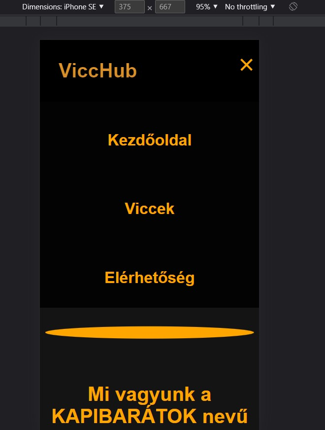

# ***Tesztelések dokumentációi***

## Elérhetőség tesztelése

### 1. Neveken lévő hivatkozás tesztelése:
### 1.1 **Elvárás:**
* Névre kattintva be kell jönnie egy email küldő felületnek, ahol az általunk kiválaszott személy számára küldhetünk email-t.
### 1.2 **Teszt:**
* **Illés Zoltán Levente** hivatkozás: a névre kattintva bejön az emailküldő felület, ahol Illés Zoltán Levente számára küldhetünk email-t.
* **Bezerédi Erik** hivatkozás: a névre kattintva bejön az emailküldő felület, ahol Bezerédi Erik számára küldhetünk email-t.
* **Kocsis Olivér** hivatkozás: a névre kattintva bejön az emailküldő felület, ahol Kocsis Olivér számára küldhetünk email-t.
* **Vass Bálint** hivatkozás: a névre kattintva bejön az emailküldő felület, ahol Vass Bálint számára küldhetünk email-t.
* **Kapibarátok** gmail hivatkozás: a névre kattintva bejön az emailküldő felület, ahol a fejlesztő csapat számára küldhetünk email-t.

### 2. Tábla kicsúszás:
### 2.1 **Elvárás:**
* A csapat tagjai tábla ne csússzon ki a képből.
### 2.2 **Teszt:**
* Megadott képernyőméret esetén a csapat tagjai táblázat "húzhatóvá" válik.

---

## **Hivatkozások tesztelése**

1. Oldalak :

2. Hivatkozások :

---

## Mobilmenü tesztelés:

 ### **Elvárás:** 
* Megadott képernyőméret esetén aktiválja a **script.js** ben megírt kódot és a menü átvált a "mobil menü" módba és **CSS** szkript megváltoztatja a szerkezetet. Ez az új menü átveszi az eredeti kezelőfelület szerepét ezáltal rezponzívvá téve az oldalt.

* Azaz jobb felső sarokba megjelenik 3 vizszintes vonal amire kattintva megnyílik a legőrdülő menü. Kilépni belőle a vonalakból transzformált "**X**" segítségével lehet és vissza áll az eredeit három vonlas állapotba.

**Teszt :** 
1. Három vononalas dizájn megjelent. 

2. Kattintásra müködött.

